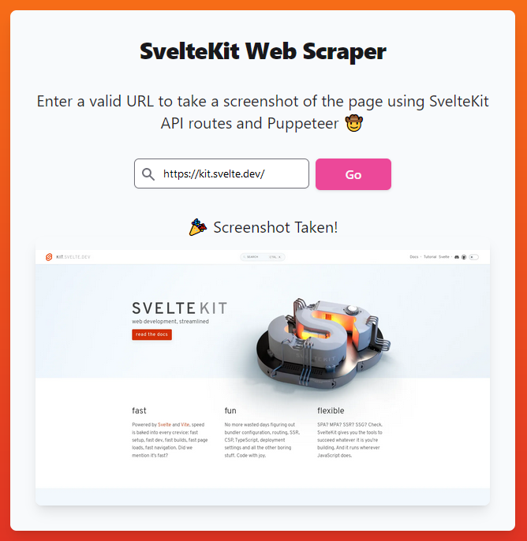

# 🤠 SvelteKit Web Scraper Demo

Live url: [https://sveltekit-web-scraper.vercel.app/](https://sveltekit-web-scraper.vercel.app/)

Does your SvelteKit application rely on data that is scraped from the web? Are you too lazy to create and deploy a separate Python backend? Do you think we should program predator missiles with JavaScript?

If you answered yes to any of those questions - look no further. This application demonstrates how to use [Puppeteer](https://pptr.dev/) in a serverless environment in order to scrape data from the web. By using SvelteKit's API route functionality, you can kick off web scraping jobs from within your SvelteKit code or from a separate location (like a cron job or an API request from another server).

While this demo focuses on how to web scrape with serverless functions, the same approach can still be used if you're deploying your SvelteKit app as a Node server with [adapter-node](https://kit.svelte.dev/docs/adapter-node).

## Background

Web scraping in full-stack JavaScript frameworks can be a bit tricky when you're deploying your app in a serverless environment. Most large hosting providers like Vercel and Netlify will deploy your app as a series of AWS Lambda functions under the hood. This can be great for keeping costs down and scaling to meet demand, but it does limit you when it comes to things like dependency size and long-running functions.

Puppeteer's standard javascript library ships with a compatible version of Chrome, which by itself is enough to put us over the standard unzipped size limit for a Lambda function (250MB). Thankfully, Puppeteer provides another library called [puppeteer-core](https://www.npmjs.com/package/puppeteer-core). This library does not install Chrome and allows us to manage the browser ourselves.

To stay under the size limit, we use the [@sparticuz/chromium-min](https://www.npmjs.com/package/@sparticuz/chromium-min) package, a minimal version of Chromium that does not ship with all of the required brotli files. Instead of bundling these files with our Node dependencies, we'll fetch them when an instance of our serverless function is created. Downloading and unpacking the brotli files on the fly from a storage service like S3 allows us to get the functionality needed for web scraping while maintaining a small enough bundle size for serverless deployments.

I would recommend going through the entire [@sparticuz/chromium-min](https://github.com/Sparticuz/chromium) README to understand the version matching requirements and to get a better idea of what's going on under the hood.

This app's `puppeteer-core` version is pinned at `19.6.3` and it uses Chromium `v110.0.1`.

## Deployment Notes

Depending on your hosting provider, you may run into timeout issues when invoking your web scraper API route, mainly if you're on the provider's free tier. A request that cold starts the API route and fetches the brotli files may exceed your free tier's function timeout limit. Subsequent requests should be faster, provided the function was able to download the Chromium .tar files.

This project is hosted under a team on Vercel's Pro plan, which allows serverless functions to run for up to 5 minutes. For reference, Vercel's hobby plan currently imposes a max runtime of 5 seconds for serverless functions.

You'll need to take this into account when adding web scraping functionality to a project on a serverless deployment.

## Project Structure

The project was generated with SvelteKit's skeleton template, with the addition of a web scraping API route located at [`src/routes/api/web-scraper/+server.js`](src/routes/api/web-scraper/+server.js). We're using JSDoc instead of TypeScript because I fat-fingered the option in the CLI and was too lazy to change it 🤘.

The UI for the demo app is located at the root page [`src/routes/+page.svelte`](src/routes/+page.svelte) and includes a simple form to send a website's URL to our web scraper API route.

## Getting Started

This project is built with `@vercel/blob` and requires an existing Vercel project and Blob Store to run locally. See [Linking Vercel](#linking-vercel) for instructions on how to link your own account.

To run this project locally, start by cloning the repository and installing the dependencies:

```bash
git clone https://github.com/b-dulaney/sveltekit-web-scraper.git
cd sveltekit-web-scraper
npm install
```

Running locally requires that you have a version of Chromium installed on your machine.

If you already have Chromium installed, run `which chromium` to grab the path.

To install a local version of Chromium, run this command:

```bash
npx @puppeteer/browsers install chromium@latest --path /tmp/localChromium
```

Next, we need to take the existing path or the location output by the chromium installation and save it as an environment variable.

Create a `.env.development.local` file at the root of the project and add the following environment variable:

```env
LOCAL_CHROMIUM_PATH=Your_Path_Here
```

It should look something like this

```env
LOCAL_CHROMIUM_PATH=/tmp/localChromium/chromium/linux-1274330/chrome-linux/chrome
```

Finally, we need to provide the URL that we'll fetch the Chromium .tar package from. If you're using this method in production, it's recommended that you host the files as close to your serverless function deployment as possible. Typically you'd use something like a S3 bucket or Vercel's blob storage. For now, we'll just point it at the download from the GitHub releases page.

Add the following to your `.env.development.local` file:

```env
CHROMIUM_DOWNLOAD_URL=https://github.com/Sparticuz/chromium/releases/download/v110.0.1/chromium-v110.0.1-pack.tar
```

With the environment variables saved, we're ready to link to Vercel and run the app locally.

## Linking Vercel

TODO - Setup instructions for Vercel CLI, project, blob storage, env variables

## Running the Project

To start the development server, run this command from the root of the project:

```bash
npm run dev
```

To test the web scraper API route, enter a valid URL into the input field and submit the form. You should see a screenshot of the page appear under the form if the action was successful.



## Contributing

Contributions are welcome! Please feel free to submit a pull request.

## License

This project is open source and available under the [MIT License](LICENSE).
